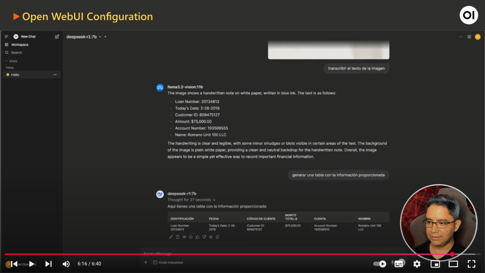

[![Issues][issues-shield]][issues-url]
[![LinkedIn][linkedin-shield]][linkedin-url]

<!-- Intro -->
<br />
<div align="center" style="text-align:center;">
  </img>
  <h1>Open WebUI</h1>

  <a style="font-size:large;" href="/src/">👨🏽‍💻 Explore the Code »</a>
  <br/>
  <a href="https://www.youtube.com/watch?v=6L1YmTRZNxM&list=PLMUWTQHw13gbk738EGtr0fWwi40B81qEw">🎬 View Demo</a>
  ·
  <a href="https://github.com/jganggini/oci-functions/issues">💣 Report Bug</a>
  ·
  <a href="https://github.com/jganggini/oci-functions/pulls">🚀 Request Feature</a>

  <div align="center" style="text-align:center;">
    <table align="center">
      <tr style="font-size:medium;">
        <td colspan="5">AI Stack</td>
        <td colspan="2">LLM</td>
      </tr>
      <tr align="center" >
        <td></td>
        <td></td>
        <td></td>
        <td></td>
        <td></td>
        <td></td>
        <td></td>
      </tr>
      <tr style="font-size:small;">
        <td>Open WebUI</td>
        <td>Docker</td>
        <td>Git</td>
        <td>NGinx</td>
        <td>Ollama</td>
        <td>Meta</td>
        <td>DeepSeek</td>
      </tr>
    </table>
  </div>

</div>

## 💼 𝗨𝘀𝗲 𝗖𝗮𝘀𝗲
Este caso de uso se centra en ofrecer soluciones de inteligencia artificial open source de fácil despliegue y uso, permitiendo a empresas y desarrolladores acceder rápidamente a tecnología de vanguardia. Se aborda implementando Open WebUI para gestionar modelos de IA, junto con Ollama para ejecutar modelos de lenguaje (LLM) en entornos CPU o GPU, y Nginx para asegurar el tráfico HTTPS. Todo se orquesta con Docker Compose, lo que permite configurar perfiles específicos y una integración ágil en entornos locales o en la nube.

## 𝗖𝗼𝗺𝗽𝗼𝗻𝗲𝗻𝘁𝘀
* 🔗 Open WebUI – Interfaz intuitiva para gestionar modelos de IA
* 🦙 Ollama – Modelo de Lenguaje (LLM) adaptable a CPU o GPU
* 🔒 Nginx – Proxy inverso y gestor de HTTPS
* 🐳 Docker Compose – Orquestación y despliegue ágil de contenedores

## Installation

### 1. Set up Docker's apt repository.

```bash
# Add Docker's official GPG key:
sudo apt-get update
sudo apt-get install ca-certificates curl
sudo install -m 0755 -d /etc/apt/keyrings
sudo curl -fsSL https://download.docker.com/linux/ubuntu/gpg -o /etc/apt/keyrings/docker.asc
sudo chmod a+r /etc/apt/keyrings/docker.asc

# Add the repository to Apt sources:
echo \
  "deb [arch=$(dpkg --print-architecture) signed-by=/etc/apt/keyrings/docker.asc] https://download.docker.com/linux/ubuntu \
  $(. /etc/os-release && echo "${UBUNTU_CODENAME:-$VERSION_CODENAME}") stable" | \
  sudo tee /etc/apt/sources.list.d/docker.list > /dev/null
sudo apt-get update
```

### 2. Install the Docker packages.

```bash
sudo apt-get install docker-ce docker-ce-cli containerd.io docker-buildx-plugin docker-compose-plugin
```

### 3. Verify that the installation is successful by running the hello-world image:

```bash
sudo docker run hello-world
```

This command downloads a test image and runs it in a container. When the container runs, it prints a confirmation message and exits.

Ref: https://docs.docker.com/engine/install/ubuntu/

### 4. To install Git, run the following command:

```bash
sudo apt-get install git-all
```

### 5. Once the command output has been completed, you can verify the installation by typing:

```bash
sudo git version
```

Ref: https://github.com/git-guides/install-git

### 6. Cloning the Repository:

```bash
sudo mkdir docker
cd docker
sudo git clone https://github.com/jganggini/open-ai.git
cd open-ai/docker-open-webui-auto-https
```

### 7. Running Open WebUI using Docker Compose:

For Nvidia GPU setups:

```bash
sudo docker compose --profile gpu-nvidia pull
sudo docker compose create
sudo docker compose --profile gpu-nvidia up
```

For Non-GPU setups:

```bash
sudo docker compose --profile cpu pull
sudo docker compose create
sudo docker compose --profile cpu up
```

Ref: https://github.com/n8n-io/self-hosted-ai-starter-kit

## Step by Step (YouTube)

[](https://youtu.be/Uxy4nnS62_4?si=RHNllqde3Khoaaum)

<!-- MARKDOWN LINKS & IMAGES -->
<!-- https://www.markdownguide.org/basic-syntax/#reference-style-links -->
[issues-shield]: https://img.shields.io/github/issues/othneildrew/Best-README-Template.svg?style=for-the-badge
[issues-url]: https://github.com/jganggini/oci-functions/issues
[linkedin-shield]: https://img.shields.io/badge/-LinkedIn-black.svg?style=for-the-badge&logo=linkedin&colorB=555
[linkedin-url]: https://www.linkedin.com/in/jganggini/